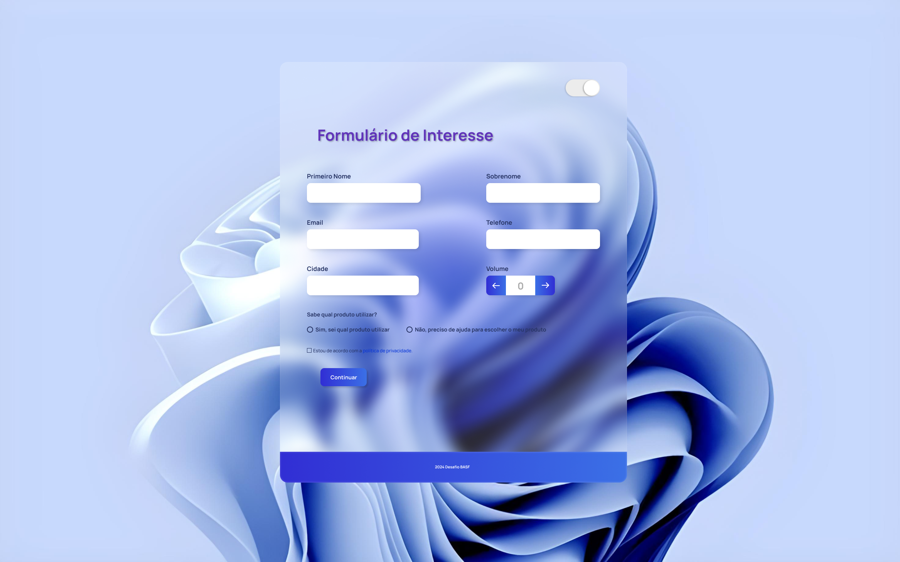
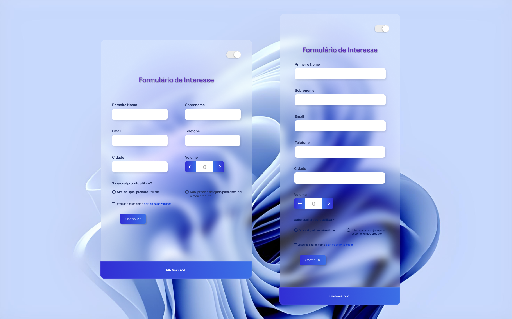
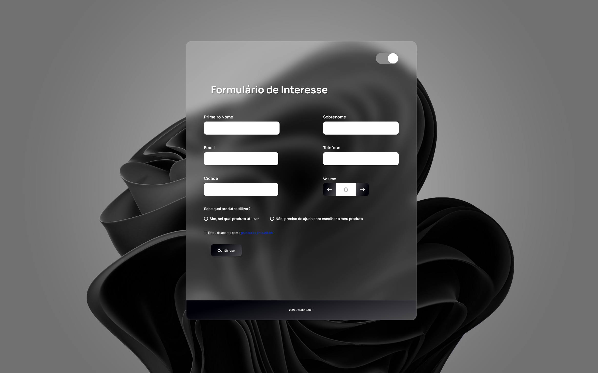

[NODE__BADGE]: https://img.shields.io/badge/Node.js-43853D?style=for-the-badge&logo=node.js&logoColor=white
[REACT__BADGE]: https://img.shields.io/badge/React-20232A?style=for-the-badge&logo=react&logoColor=61DAFB
[MYSQL__BADGE]: https://img.shields.io/badge/MySQL-00000F?style=for-the-badge&logo=mysql&logoColor=white
[NEXT.JS__BADGE]: https://img.shields.io/badge/next.js-000000?style=for-the-badge&logo=nextdotjs&logoColor=white

<h1 align="center" style="font-weight: bold;">Formulário React</h1>

![react][REACT__BADGE]
![node][NODE__BADGE]
![mysql][MYSQL__BADGE]
![next][NEXT.JS__BADGE]

    

    

    

> Link do Figma
- https://www.figma.com/file/263jyBqrh4lcfZ3w2XY9T3/Desafio-BASF?type=design&node-id=0%3A1&mode=design&t=98e90IQq5gJK90A0-1

## 📄 Documentações Consultadas

- https://react.dev/learn/start-a-new-react-project
- https://nextjs.org/docs/messages/no-stylesheets-in-head-component
- https://sequelize.org/docs/v6/other-topics/migrations/
- https://www.npmjs.com/package/cors > Configuration Options

## 🚀 Importante

  As instruções para uso do projeto estão dentro dos repositórios filhos.
